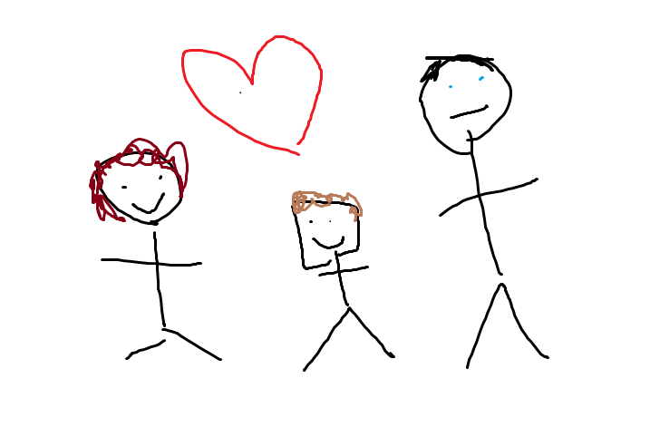

# Sobre a Biblioteca Teca-Teca

A **Biblioteca Teca-Teca** é um lugar dedicado à disseminação do conhecimento e ao prazer da leitura. Nosso objetivo é fornecer acesso a recursos valiosos para quem busca aprender mais sobre tecnologia, inovação e também para quem quer se aprofundar em histórias fascinantes que estimulam a imaginação e o pensamento crítico. 

## Nossa Missão

A nossa missão é proporcionar às pessoas a oportunidade de explorar os avanços mais recentes em tecnologia, enquanto oferecemos um espaço único para quem deseja mergulhar em narrativas envolventes

## Nossa História

A biblioteca foi fundada em 2024 por um grupo de profissionais apaixonados pela educação e pela tecnologia. Desde então, temos trabalhado para fornecer os melhores materiais e recursos para nossos usuários.

## Nossa Equipe

Nossa equipe é composta por 3 estudantes apaixonado por leitura sempre prontos para ajudar e fornecer o melhor suporte possível para quem visita a nossa biblioteca.

